# Testing3
Дисциплина: Управление Качеством Программных Систем
Лабораторная работа №3
ПИ20-3 Хертек Ясемин

# План работы
Так как 99% кода требовало импортирования библиотеки requests, был установлен данный модуль (pip/pip3 install requests) и импортирован в каждый программный код
## 1. Написать приложение содержащие функции работы с API:
   реализовать методы:
        GET, 
        POST, 
        PUT, 
        DELETE
### Get
Было реализовано 2 функции для метода get: get (для получения ключа API) и get_pets (для получения списка питомцев. 

Программа get обращается за получением ключа API, посредством передачи данных пользователя, чтобы проверилось их наличие в БД. Если такие данные есть, то пользователь считается проверенным и ему .get посылает ключ. Сам же ключ необходим в каждом действии при работе с API.
Произведен парсинг по ключу, импорт модуля json, возвращение значение ключа, затем импорт этой программы со значением ключа
Код:

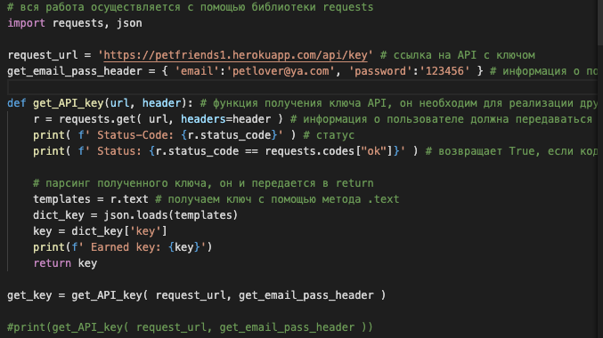​

Итог - вывод API ключа:

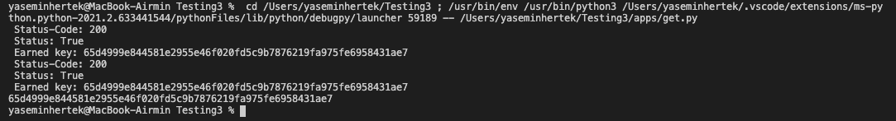​

Функция get_pets
GET запрос к API за получением информации о питомцах пользовтеля. В списке содержится информация о имени, id, типе животного и фотография на аватарке.
Код:
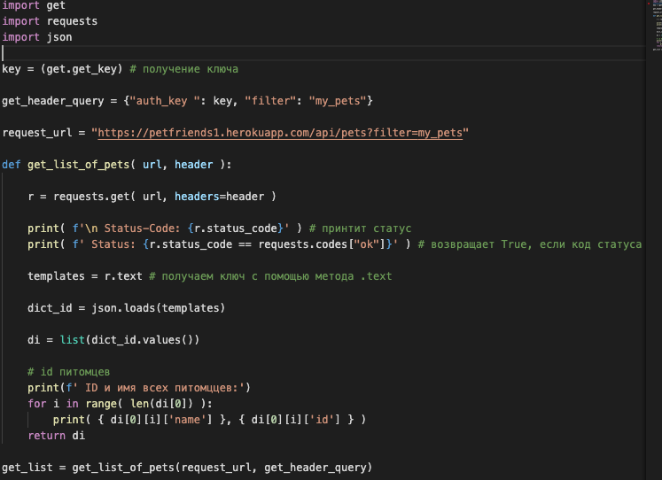​
Итог - вывод списка питомцев пользователя:
​

### Post
Было реализовано 3 функции для метода post: post_create_pet (для создания в БД нового животного), post_add_pet_w_info (для создания животного, но с добавочной информацией) и post_add_photo (реализует обновление аватарки питомца на сайте).
1) post_create_pet
Программа передает необходимые параметры для добавления нового питомца (ключ аутнтификации, имя, тип, возраст) и использует метод post модуля requests:
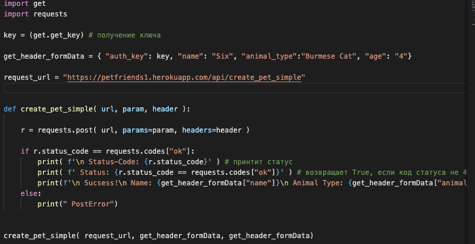​
Итог - создание нового животного с заданными параметрами:
консоль:
​
сайт:
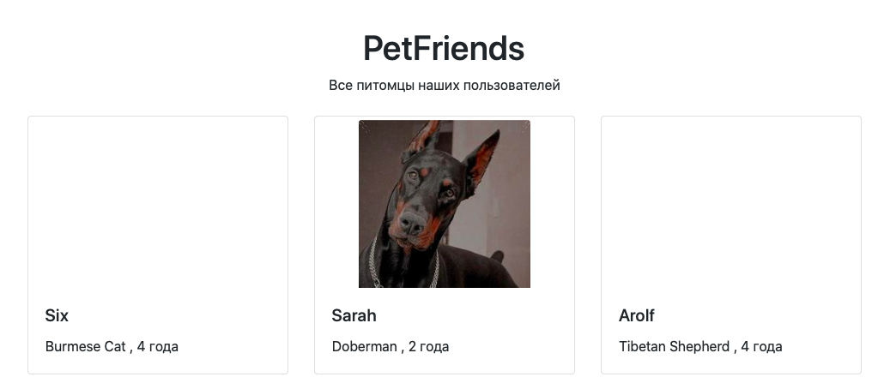​

2) post_add_pet_w_info
Аналогичная структура как и с обычным созданием питомца, за исключением дополнительного параметра "Files", в него передается изображение в бинарном виде:
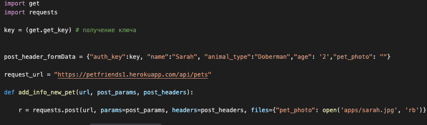​
Итог - добавление нового животного с заданными параметрами и аватаркой (доберман Sarah):
консоль:
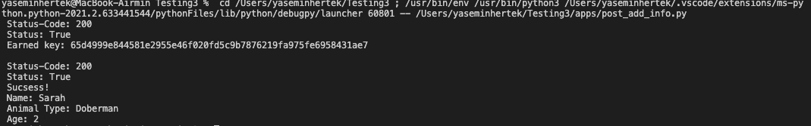​
сайт:
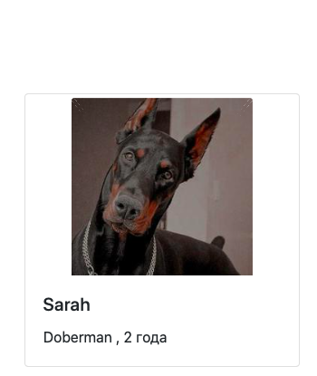​

3) post_add_photo
В методе отсутствуют параметры с именем, типом и возрастом животного, поскольку они не нужны. Нужен ID животного для определения нужного нам питомца.
Парсинг по ID был реализован по нахождению по имени, поскольку ID это произвольный набор символов и его трудно запоминать, лучше находить животного по имени и возвращать его ID.
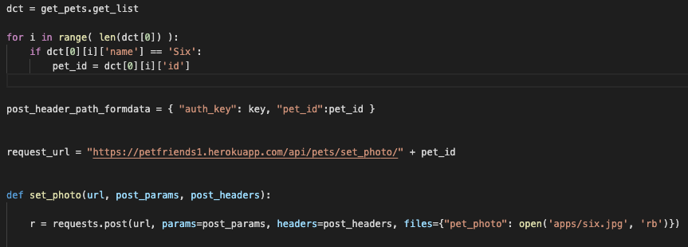​
Итог - добавляем аватарку новому, ранее созданному животному, - Six (Burmese Cat):
консоль:

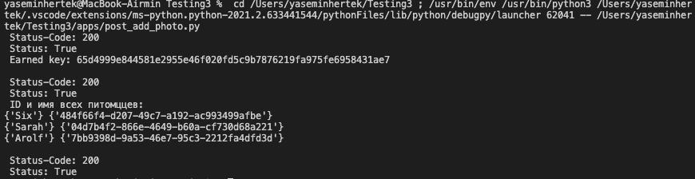​

сайт:
до
​
после
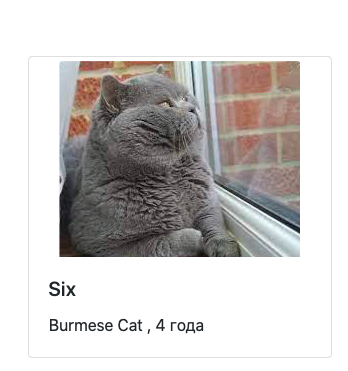​

### Put
Метод PUT, реализует изменение данных у существующего питомца. Аналогичная история, по имени животного находится его ID, по ID находится список с информацией о питомце и в него передаются новые данные.
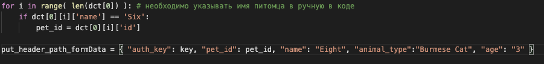​
Итог работы - (новое имя кота Six - это Eight, 3 года):
консоль:
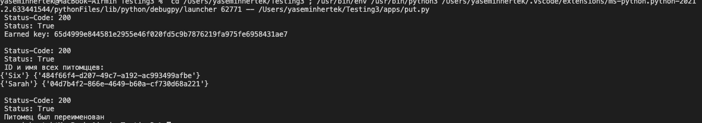​
сайт:
до
​
после
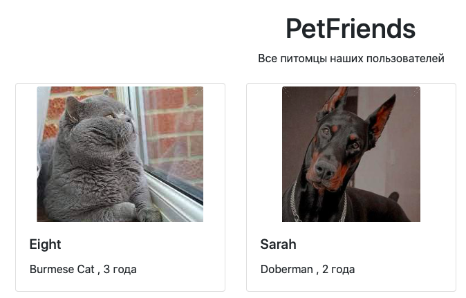​

### Delete
Метод DELETE, работает как и "Добавление изображения существующему питомцу", парсится ID животного по его имени и удаляется, вместо изменение аватара животного.
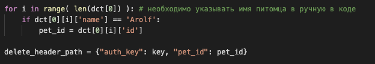​
Итог работы - (удалили карточку животного Arolf):
консоль:

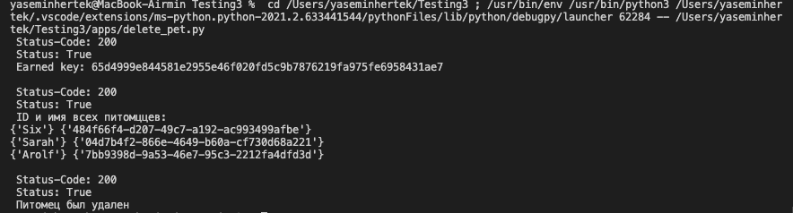​
сайт:
до
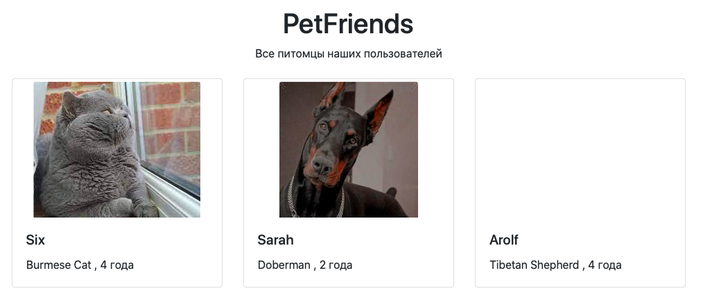​
после
​

# Тестирование функций
Тесты были выполнены в одном программном файле test_code.py. Импортировались все необходимые библиотеки: pytest, requests, ранее созданные методы в качестве модулей
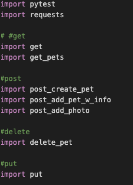​

1. Использование фикстур
В фикстуре содержиться необходимая информация для проверки ( у меня это просто вызываемая программа), под ней находится её проверка:
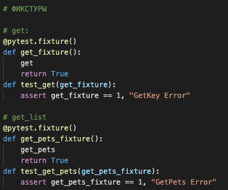​
Проверка считается удачной, если работа фикстуры возвращается True ( следовательно в функции проверки, True сравнивается с 1, если истинно, тогда проверка проходит )
Итог проверки фикстур (покрытие 100%):
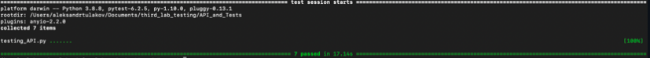​

2. Параметризация
В отдельные переменные передаются значения для будущих параметров в параметризации, затем создается саму параметризацию (пример на методе GET):
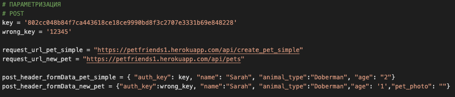​
Сначала задаются параметры необходимые для проверки.
Затем идут списки (их количество зависит от количества желаемых проверок и переданных значений) В моем случае два списка, в них содержится информация, которая будет использоваться для проверки ( т.е. две проверки )
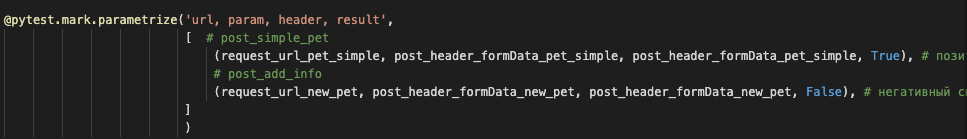​

3. Реализованы два сценария проверки: Негативный и Позитивный. В позитивном я передаю правильную информацию для проверки, а в негативном, специально указываю неверный ключ API, и в ожидаемом результате указываю Fasle, ( т.е. при ошибке, проверка будет считаться пройденной)
​

Итог параметризации (покрытие 100%):
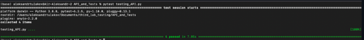​
Общий итог (покрытие 100%):
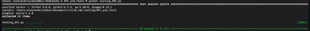​